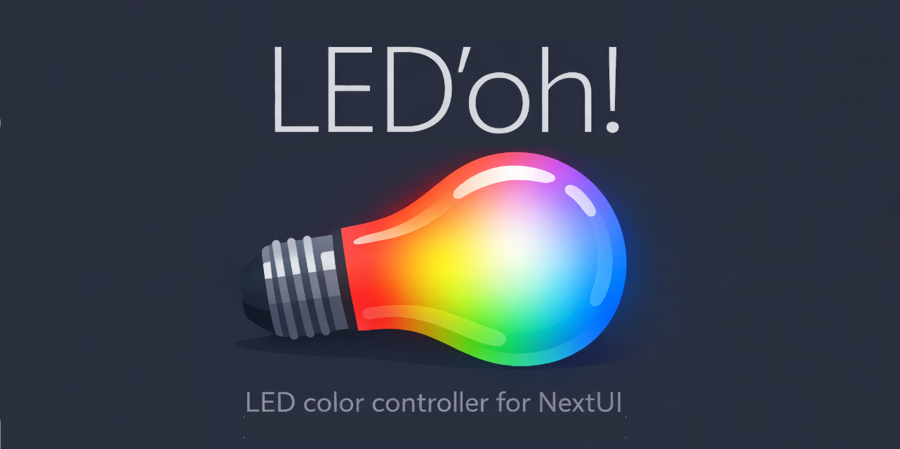
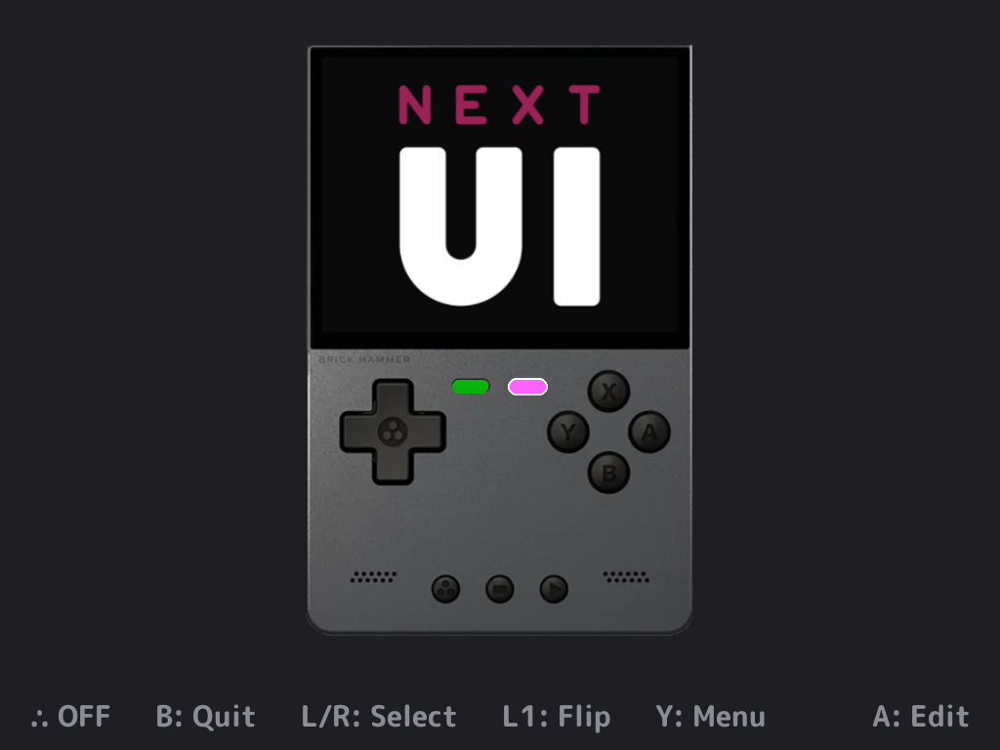
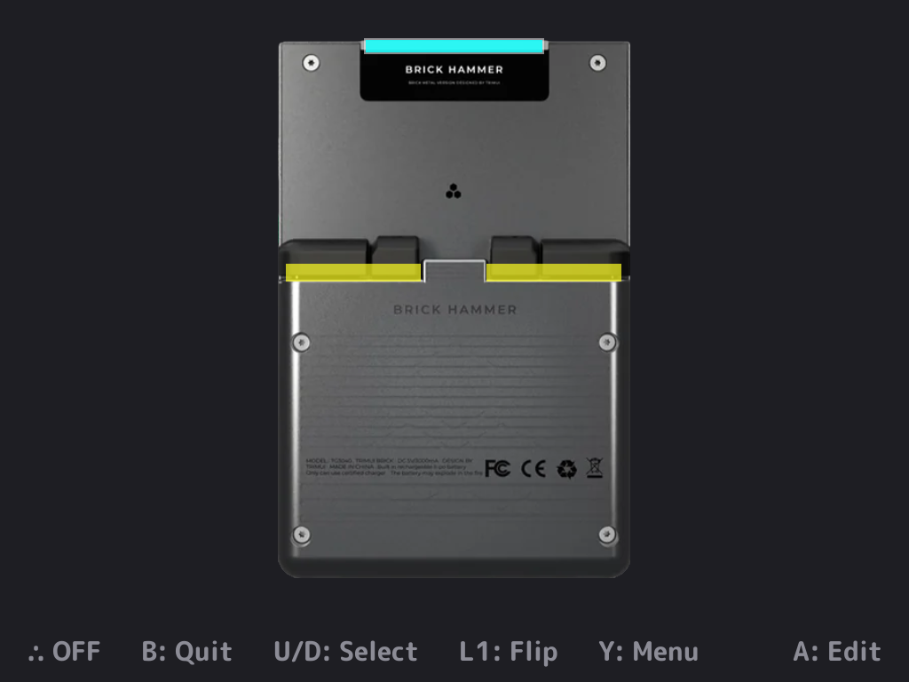
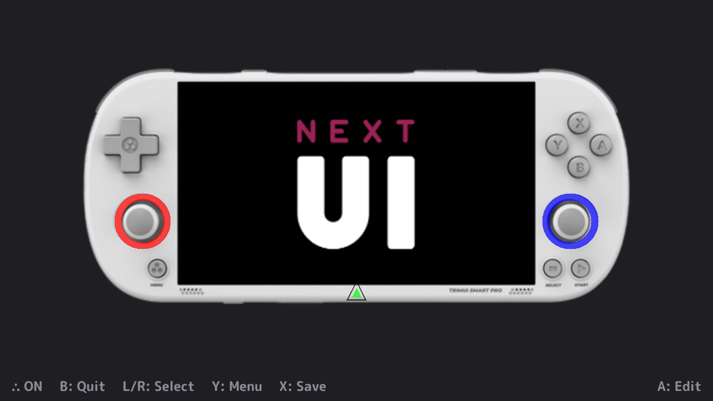
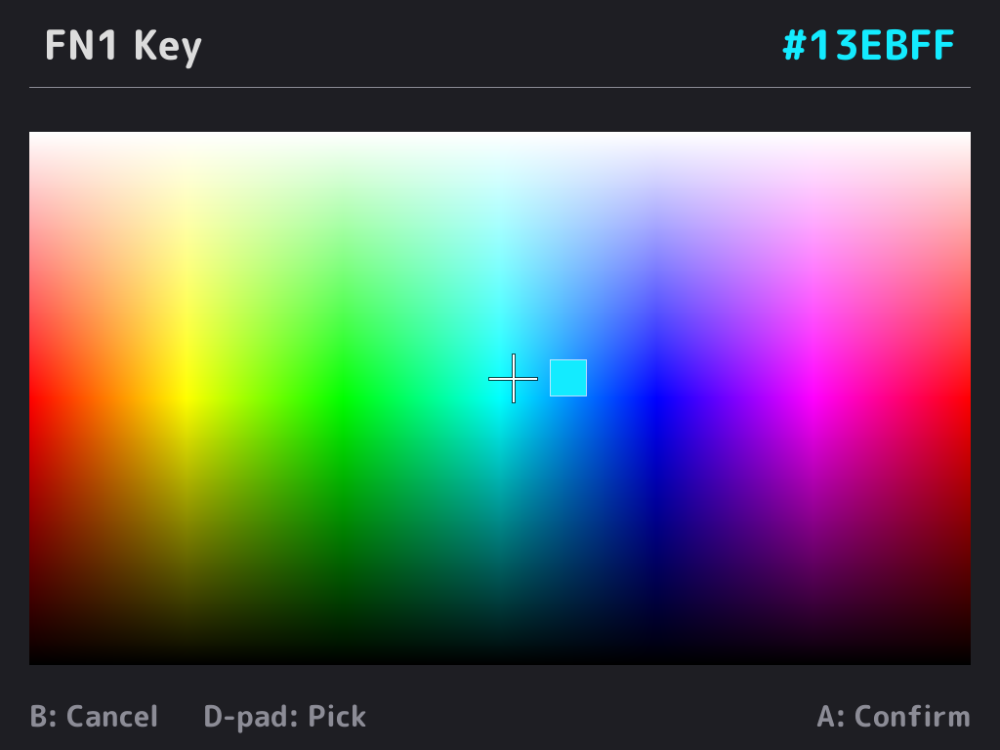
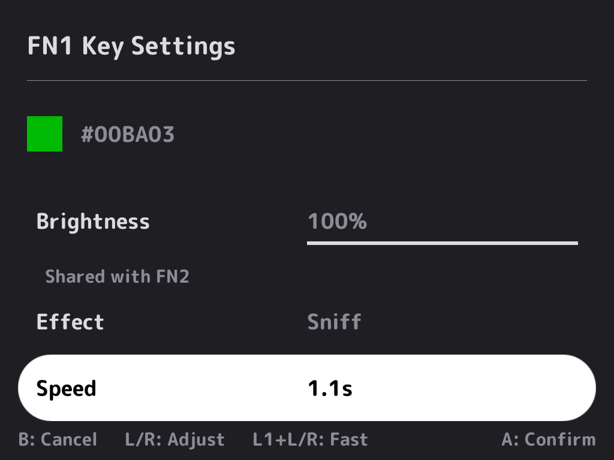
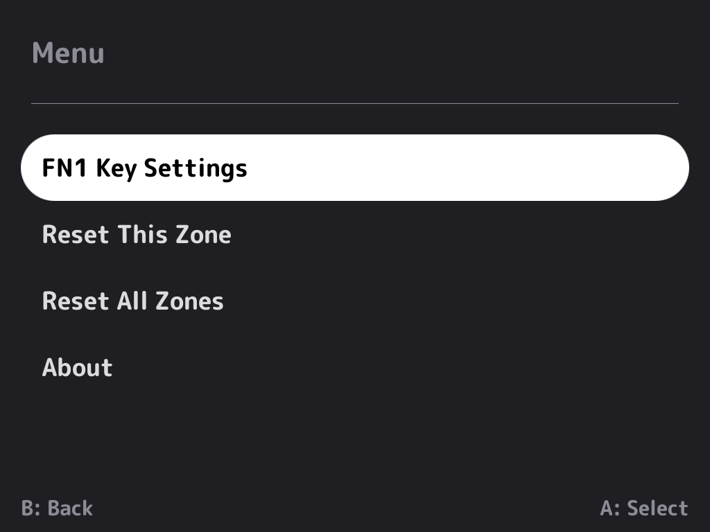

<div align="center">

# LED'oh!



[](https://github.com/ericreinsmidt/nextui-ledoh/releases)
[](https://github.com/ericreinsmidt/nextui-ledoh/releases)
[](LICENSE)

A graphical LED color controller for TrimUI Brick, Brick Hammer, and Smart Pro running NextUI.

</div>

## Features

- **Visual device view** — Front and back representations of your device with LED zones in their physical positions
- **2D HSL color picker** — Full-screen color field with crosshair cursor and live hardware preview
- **Per-zone settings** — Brightness, effect type, and animation speed for each LED zone
- **Real-time feedback** — Physical LEDs update instantly as you pick colors and adjust settings
- **LED toggle** — Quickly turn all LEDs off or on with the ∴ button
- **Multi-device support** — Automatically detects Brick, Brick Hammer, or Smart Pro and adapts the UI
- **Random front images** — Device view randomly picks from available front image variants on each view flip
- **NextUI compatible** — Reads and writes the same settings file as the built-in LED control

## LED Zones

### TrimUI Brick / Brick Hammer

| Zone | View | Description |
|------|------|-------------|
| FN1 Key | Front | Left function key LED |
| FN2 Key | Front | Right function key LED |
| Top Bar | Back | LED strip along the top edge |
| L/R Triggers | Back | Left and right trigger LEDs |

> **Note:** FN1 and FN2 share a brightness path — changing one changes the other.

### TrimUI Smart Pro

| Zone | View | Description |
|------|------|-------------|
| Joystick L | Front | Left joystick ring LED |
| Logo | Front | Triangle logo indicator LED |
| Joystick R | Front | Right joystick ring LED |

> **Note:** All Smart Pro zones share a single brightness path — changing brightness on any zone changes all of them.

## Screenshots

| | | |
|:---:|:---:|:---:|
|  |  |  |
| Brick — Front | Brick — Back | Smart Pro |
|  |  |  |
| Color Picker | Zone Settings | Menu |

## Controls

### Device View

| Button | Action |
|--------|--------|
| D-pad L/R | Select zone (front view) |
| D-pad U/D | Select zone (back view, Brick only) |
| L1/R1 | Switch front/back view (Brick only) |
| A | Open color picker for selected zone |
| X | Quick save |
| Y | Menu (zone settings, reset, about) |
| ∴ | Toggle all LEDs off/on |
| B | Quit (prompts to save if unsaved changes) |

### Color Picker

| Button | Action |
|--------|--------|
| D-pad (8-direction) | Move cursor to pick color |
| A | Confirm color |
| B | Cancel (restore original color) |

### Zone Settings (via Y → Menu)

| Button | Action |
|--------|--------|
| D-pad U/D | Move between settings rows |
| D-pad L/R | Adjust value |
| L1/R1 + L/R | Fast adjust |
| A | Confirm |
| B | Cancel (restore original values) |

## Installation

### NextUI Pak Store

LED'oh! is available in the [NextUI Pak Store](https://github.com/NextUI-Paks). Install it directly from the store on your device.

### Manual Install

1. Download the latest release zip from [Releases](https://github.com/ericreinsmidt/nextui-ledoh/releases)
2. Extract to your SD card — the `LED'oh!.pak` folder goes in `Tools/tg5040/`
3. Launch from the Tools menu in NextUI

## Supported Devices

- TrimUI Brick
- TrimUI Brick Hammer
- TrimUI Smart Pro

## Building

Requires Docker and the NextUI tg5040 toolchain image.

```bash
make build      # Build via Docker
make package    # Build + create distribution zip
make clean      # Remove build artifacts
```

The binary is cross-compiled using the `ghcr.io/loveretro/tg5040-toolchain` Docker image. No local cross-compiler setup required.

## Hardware Research

See [brick_led_research.md](brick_led_research.md) for per-LED framebuffer findings on the TrimUI Brick (14 individually addressable LEDs via `frame_hex`).

## Credits

- Built with [PakKit](https://github.com/ericreinsmidt/pakkit) and [Apostrophe](https://github.com/Helaas/Apostrophe)
- For [NextUI](https://github.com/LoveRetro/NextUI)

## License

MIT — see [LICENSE](LICENSE)
